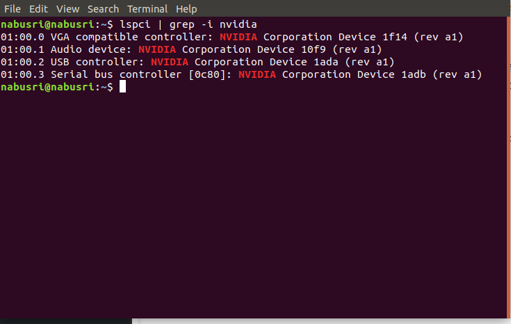
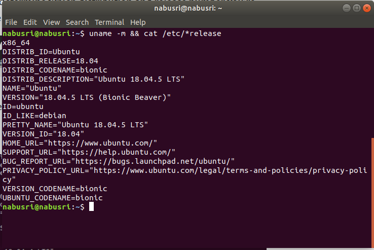

#Install Cuda

1. Prerequisite instructions
1.1 Verify that you have CUDA capable GPU using : 

`lspci | grep -i nvidia`


It lists the Nvidia GPU you have on your system. Check that on https://developer.nvidia.com/cuda-gpus. If it is listed, your GPU is CUDA-capable. Also, see, it’s compute capability. . My GPU has compute compatibility of 7.0

1.2 Checking Linux version
There are many versions of Linux, CUDA is supported on a few distributions: To determine which distribution and release number you’re running, type the following at the command line.

`uname -m && cat /etc/*release`




1.3 Verify that system has gcc installed.
Many systems come with preinstalled GCC. Use gcc --version to check if GCC is installed on your system. If not installed, use below commands.
```
sudo apt-get install manpages-dev
sudo apt-get update
sudo apt install build-essential
sudo apt-get install manpages-dev
```
1.4 Verifying correct Kernel headers
Your system is running some kernel versions. Cuda needs kernel headers and development packages for that same kernel version at the time of installation and at the time of the rebuilt of the library. For example, if your system is running kernel version 3.17.4–301, the 3.17.4–301 kernel headers and development packages must also be installed
The kernel headers and development packages for the currently running kernel can be installed with below command, where uname -r gives the current Kernel version on your system.

`sudo apt-get install linux-headers-$(uname -r)`


2. Installing CUDA Toolkit
If we are here, you have all the prerequisites to install CUDA on your system now. Let’s start it’s installation now.
The CUDA Toolkit can be installed using either of two different installation mechanisms: distribution-specific packages (RPM and Deb packages), or a distribution-independent package (runfile packages). The distribution-independent package has the advantage of working across a wider set of Linux distributions, but does not update the distribution’s native package management system. The distribution-specific packages interface with the distribution’s native package management system. It is recommended to use the distribution-specific packages, where possible. We will use a distribution-specific package for our purpose.
One can find documentation related to any CUDA version from here https://developer.nvidia.com/cuda-toolkit-archive . I am specifically doing this for CUDA version 10.1 .

#download desired version of CUDA, 10.1 in my case. 
2.1 `wget https://developer.download.nvidia.com/compute/cuda/repos/ubuntu1804/x86_64/cuda-repo-ubuntu1804_10.1.105-1_amd64.deb`

2.2 `sudo dpkg -i cuda-repo-ubuntu1804_10.1.105-1_amd64.deb`
 
2.3 `sudo apt-key adv --fetch-keys`             https://developer.download.nvidia.com/compute/cuda/repos/ubuntu1804/x86_64/7fa2af80.pub
2.4 `sudo apt-get update`
The next line is tricky and confusing for most people. Since it installs the most recent Cuda version, and shouldn’t be used if you don’t want the latest version of CUDA.

sudo apt-get install cuda(don’t use it, use below one )

2.5 `sudo apt-get install cuda-10-1`
If you do nvidia-smi or nvcc — version now, they would not work because they are yet to be added to bashrc. Update bashrc now.
Add the below lines to your bashrc.
```
export PATH="/usr/local/cuda-10.1/bin:$PATH"
export LD_LIBRARY_PATH="/usr/local/cuda-10.1/lib64:$LD_LIBRARY_PATH"
```
After which do,
`source .bashrc`
Try, `nvidia-smi` or `nvcc — version` now. If any of them are not working now, try to reboot the system. It would work.
We need to install Pytorch and TensorFlow now. we can use pip or conda environment. If you don’t want to install CuDNN manually, it’s better to use anaconda. It automatically installs CuDNN and saves a lot of hassle. I will use anaconda to install Tensorflow’s and Pytorch’s GPU version.
Install anaconda now. I specifically followed this link https://www.digitalocean.com/community/tutorials/how-to-install-anaconda-on-ubuntu-18-04-quickstart
Make the environment now using conda like and activate it as well:
```
conda create --name my_env python=3
conda activate my_env
```
Inside this environment namely my-env, install the proper version of Tensorflow and GPU.
```
conda install pytorch torchvision cudatoolkit=10.1 -c pytorch
conda install tensorflow-gpu
```
It will install PyTorch and TensorFlow. To check if they are working: Open python terminal now and import TensorFlow and torch inside it. Now, do:
torch.cuda.is_available()
If it returns True, the torch is able to use GPU. Check for TensorFlow now. If the below command shows GPU name then Tensorflow is working with GPU as well.
print (tf.test.gpu_device_name())
Now, nvidia-smi, nvcc — version both would work, and in fact, torch and Tensorlfow are able to use GPUs as well. Stay tuned for how to train deep learning models on GPU using docker.


